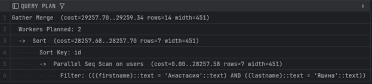
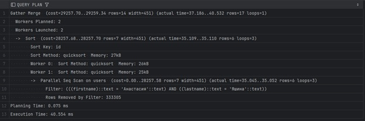
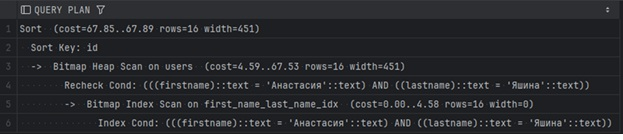
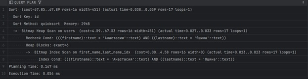
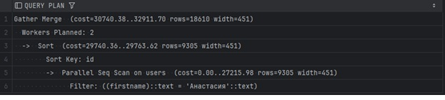
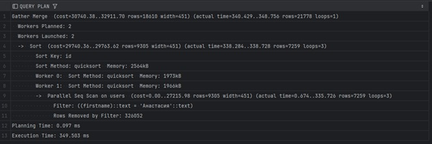
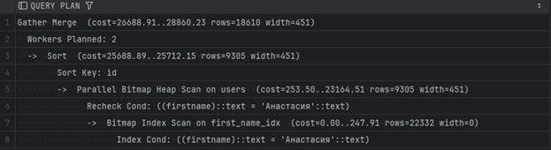
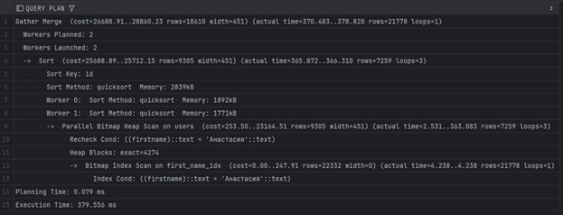
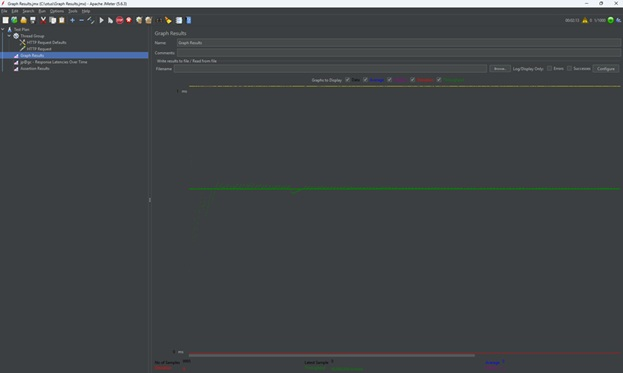
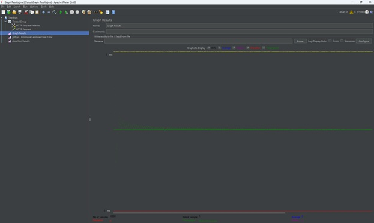

# Производительность индексов

## Поиск по 2 полям, имени и фамилии 
```sql
explain (select * from users where FIRSTNAME = 'Анастасия' and LASTNAME = 'Яшина' order by id);
```



```sql
explain analyse (select * from users where FIRSTNAME = 'Анастасия' and LASTNAME = 'Яшина' order by id);
```



Создание индекса
```sql
CREATE INDEX first_name_last_name_idx ON USERS USING btree(FIRSTNAME, LASTNAME);
```

Выполнение запроса с индексом
```sql
explain (select * from users where FIRSTNAME = 'Анастасия' and LASTNAME = 'Яшина' order by id);
```




```sql
explain analyse (select * from users where FIRSTNAME = 'Анастасия' and LASTNAME = 'Яшина' order by id);
```



## Поиск по 1 полю, имени
```sql
explain (select * from users where FIRSTNAME = 'Анастасия' order by id);
```




```sql
explain analyse (select * from users where FIRSTNAME = 'Анастасия' order by id);
```



Создание индекса
```sql
CREATE INDEX first_name_idx ON USERS USING btree(FIRSTNAME);
```

Выполнение запроса с индексом
```sql
explain (select * from users where FIRSTNAME = 'Анастасия' order by id);
```




```sql
explain analyse (select * from users where FIRSTNAME = 'Анастасия' order by id);
```


## Выводы
В результате создания индекса и построения плана запроса видно, что стоимость меньше, время выполнения меньше, памяти в итоге меньше, процесс 1 вместо двух.

## Нагрузочное тестирование в JMeter

Без индекса


С индексом
