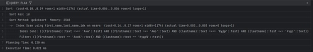

# Производительность индексов

## Поиск по 2 полям, имени и фамилии 
```sql
explain analyse (select * from users where FIRSTNAME = 'Анастасия' and LASTNAME = 'Яшина' order by id);
```


Создание индекса
```sql
CREATE INDEX first_name_last_name_idx ON USERS USING btree(FIRSTNAME varchar_pattern_ops, LASTNAME varchar_pattern_ops);
```

Выполнение запроса с индексом

```sql
explain analyse (select * from users where FIRSTNAME = 'Анастасия' and LASTNAME = 'Яшина' order by id);
```



## Выводы
В результате создания индекса и построения плана запроса видно, что после создания индекса план запроса поменялся и с индексом стал выполняться быстрее
## Нагрузочное тестирование в JMeter

Без индекса


С индексом
